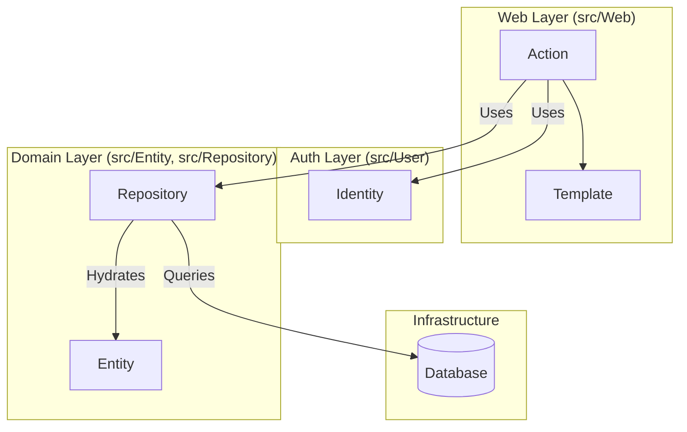
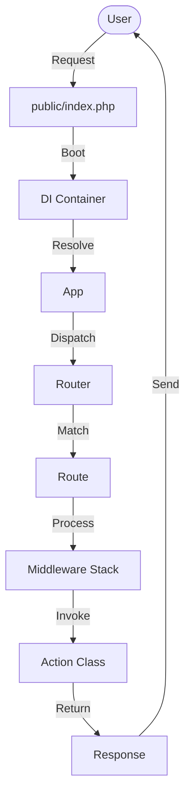

# 🏗️ Architecture Overview

This document describes the architectural decisions and patterns used in the Yii3 Web Application.

## 🌟 Core Philosophy: Yii3

This application is built on **Yii3**, which differs significantly from Yii2.
-   **Component-Based:** Yii3 is a suite of independent packages (e.g., `yiisoft/di`, `yiisoft/http`, `yiisoft/db`) rather than a monolithic framework.
-   **Strict Types:** The codebase leverages PHP 8 features and strict typing.
-   **DI Container:** Dependency Injection is central to the application. Almost everything is wired through the container.

## 📂 Application Structure



The application follows a modular, feature-based structure rather than a traditional flat MVC (Model-View-Controller) structure.

### 1. The Web Layer (`src/Web/`)
The Web layer is organized by **Features** or **Pages**.
-   **Purpose:** Handles HTTP requests and responses.
-   **Components:**
    -   **Actions:** Equivalent to Controller actions. Each Action is a standalone class (e.g., `App\Web\HomePage\Action`).
    -   **Templates:** View files are often co-located or organized similarly.
    -   **Forms:** Request validation models.

**Example Structure:**
```
src/Web/
├── Auth/           # Authentication Feature
│   ├── LoginAction.php
│   ├── LogoutAction.php
│   └── login.php   # Template
├── HomePage/       # Home Page Feature
│   ├── Action.php
│   └── home.php
```

### 2. The Domain Layer (`src/Entity`, `src/Repository`)
Business logic is separated from the HTTP layer.
-   **Purpose:** Encapsulates business rules and data persistence.
-   **Components:**
    -   **Entities:** Immutable data objects (e.g., `App\Entity\User`).
    -   **Repositories:** Data access abstraction (e.g., `App\Repository\UserRepository`).
    -   **Services:** Business operations.

### 3. Authentication Layer (`src/User/`)
Distinct from the core domain, this module handles Authentication Identity.
-   **Purpose:** Manages user sessions and identity verification.
-   **Components:**
    -   **Identity:** Lightweight object for auth state (e.g., `App\User\Identity`).
    -   **IdentityRepository:** Fetches identities for the `CurrentUser` service.
-   **Note:** See [Key Components](COMPONENTS.md) for a detailed explanation of the "Two Users" pattern.

### 4. Configuration (`config/`)
Configuration is managed by `yiisoft/config`. Instead of a single config file, configurations are split and merged.

-   **`configuration.php`:** The "Merge Plan". Defines how files are combined.
-   **`common/`:** Configurations shared between Web and Console.
-   **`web/`:** Web-specific configs (routes, request handling).
-   **`console/`:** Console-specific configs (commands).
-   **`params.php`:** Simple key-value pairs (DB credentials, flags).

**How it works:**
The `composer.json` defines a `config-plugin-file`. When the app boots, the plugin merges the files defined in the plan into a single configuration array used to build the DI container.

## 🔄 Request Lifecycle



1.  **Entry Point:** `public/index.php` (for Web) or `yii` (for Console).
2.  **Container Build:** `yiisoft/config` loads and merges configurations to build the DI Container.
3.  **Routing:** `yiisoft/router` matches the URL to a Route (defined in `config/common/routes.php`).
4.  **Middleware:** The request passes through a global middleware pipeline (e.g., ErrorHandler, Session, CSRF).
5.  **Action:** The matched Action class is instantiated and invoked.
6.  **Response:** The Action returns a `Response` object (often using a `ViewRenderer`).

## 🎨 Frontend Architecture

-   **Tailwind CSS:** Styling is handled by Tailwind.
-   **Source:** `src/input.css` contains the source CSS and Tailwind directives.
-   **Build:** The CSS is compiled to `assets/main/tailwind.css`.
-   **Integration:** The layout files include the compiled CSS asset.

## 💾 Database Access

-   **Library:** `yiisoft/db` (Database Abstraction Layer).
-   **Migrations:** Managed via `yiisoft/db-migration` in `migrations/`.
-   **Repositories:** Used to abstract database queries from the business logic.
