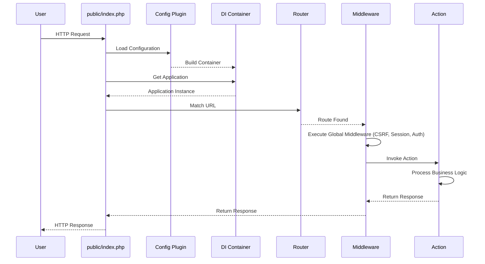
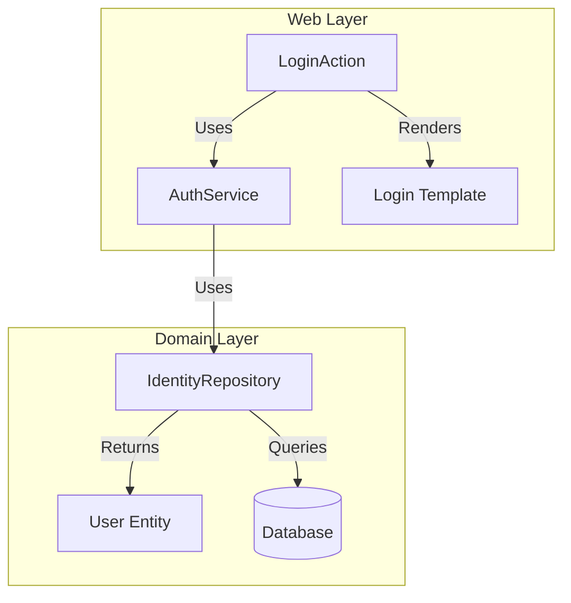

# 🏗️ Architecture Overview

This document describes the architectural decisions and patterns used in the Yii3 Web Application.

## 🌟 Core Philosophy: Yii3

This application is built on **Yii3**, which differs significantly from Yii2.
-   **Component-Based:** Yii3 is a suite of independent packages (e.g., `yiisoft/di`, `yiisoft/http`, `yiisoft/db`) rather than a monolithic framework.
-   **Strict Types:** The codebase leverages PHP 8 features and strict typing.
-   **DI Container:** Dependency Injection is central to the application. Almost everything is wired through the container.

## 📂 Application Structure

The application follows a modular, feature-based structure rather than a traditional flat MVC (Model-View-Controller) structure.

### 1. The Web Layer (`src/Web/`)
The Web layer is organized by **Features** or **Pages**.
-   **Purpose:** Handles HTTP requests and responses.
-   **Components:**
    -   **Actions:** Equivalent to Controller actions. Each Action is a standalone class (e.g., `App\Web\HomePage\Action`).
    -   **Templates:** View files are often co-located or organized similarly.
    -   **Forms:** Request validation models.

**Example Structure:**
```
src/Web/
├── Auth/           # Authentication Feature
│   ├── LoginAction.php
│   ├── LogoutAction.php
│   └── login.php   # Template
├── HomePage/       # Home Page Feature
│   ├── Action.php
│   └── home.php
```

### 2. The Domain Layer (`src/Entity`, `src/User`)
Business logic is separated from the HTTP layer.

**Pattern: Repository + Immutable Entity**
Unlike Yii2's ActiveRecord (which mixes data and behavior), this project separates them:
-   **Entities (`src/Entity`):** Plain, immutable PHP objects that hold data. They have NO knowledge of the database.
-   **Repositories (`src/User/IdentityRepository`):** Classes responsible for saving and retrieving Entities from the database.

### 3. Configuration (`config/`)
Configuration is managed by `yiisoft/config`. Instead of a single config file, configurations are split and merged.

-   **`configuration.php`:** The "Merge Plan". Defines how files are combined.
-   **`common/`:** Configurations shared between Web and Console.
-   **`web/`:** Web-specific configs (routes, request handling).
-   **`console/`:** Console-specific configs (commands).
-   **`params.php`:** Simple key-value pairs (DB credentials, flags).

**How it works:**
The `composer.json` defines a `config-plugin-file`. When the app boots, the plugin merges the files defined in the plan into a single configuration array used to build the DI container.

## 🔄 Request Lifecycle



## 🎨 Frontend Architecture

-   **Tailwind CSS:** Styling is handled by Tailwind.
-   **Source:** `src/input.css` contains the source CSS and Tailwind directives.
-   **Build:** The CSS is compiled to `assets/main/tailwind.css`.
-   **Integration:** The layout files include the compiled CSS asset.

## 💾 Database Access

-   **Library:** `yiisoft/db` (Database Abstraction Layer).
-   **Migrations:** Managed via `yiisoft/db-migration` in `migrations/`.
-   **Repositories:** Used to abstract database queries from the business logic.

## 🧩 Component Architecture


