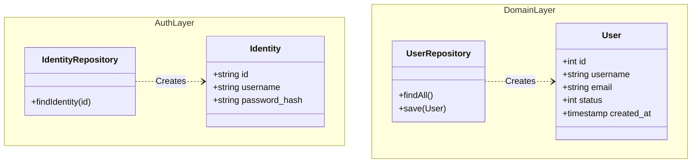

# 🧩 Key Components

This document details the key components and architectural patterns used in the application, specifically focusing on areas that might be confusing or require specific context.

## 👥 The "Two Users" Pattern

A critical architectural distinction in this codebase is the separation between **Authentication Identity** and **Domain User Entity**. You will find "User" related code in two different places, and they serve distinct purposes.

### 1. Authentication Identity (`src/User/`)

*   **Location:** `src/User/Identity.php`, `src/User/IdentityRepository.php`
*   **Purpose:** Strictly for **Authentication** and **Session Management**.
*   **Interfaces:** Implements `Yiisoft\Auth\IdentityInterface`.
*   **Characteristics:**
    *   Lightweight (only contains fields needed for auth: ID, username, password hash).
    *   Used by the `CurrentUser` service to maintain login state.
    *   `IdentityRepository` implements `IdentityRepositoryInterface` to fetch identities for the auth subsystem.

**When to use:**
*   When checking if a user is logged in (`$currentUser->isGuest()`).
*   When getting the current user's ID (`$currentUser->getId()`).
*   In Login/Logout actions.

### 2. Domain User Entity (`src/Entity/`)

*   **Location:** `src/Entity/User.php`, `src/Repository/UserRepository.php`
*   **Purpose:** The **Business Domain Model**.
*   **Characteristics:**
    *   Rich entity containing full user profile data (created_at, status logic, etc.).
    *   Immutable design (modification methods return new instances).
    *   Decoupled from the authentication mechanism.
    *   `UserRepository` handles complex queries, filtering, and CRUD operations unrelated to simple auth.

**When to use:**
*   When displaying a user's profile.
*   When listing users in an admin panel.
*   When performing business logic (e.g., checking if a user is active, updating email).

### Summary Table

| Feature | Auth Identity (`src/User`) | Domain Entity (`src/Entity`) |
| :--- | :--- | :--- |
| **Primary Role** | Session & Login | Business Logic & Data Management |
| **Class Name** | `App\User\Identity` | `App\Entity\User` |
| **Repository** | `IdentityRepository` | `UserRepository` |
| **Richness** | Minimal (Auth fields only) | Full (All DB columns + logic) |
| **Used By** | `CurrentUser`, `LoginAction` | `Dashboard`, User Management, Profile |

### Class Diagram

---

## 🌐 Web Actions (`src/Web/`)

The Web layer is organized by **Feature**, not by technical layer (no global `controllers/` folder).

### Action Classes
Each HTTP endpoint maps to a single **Action class** (e.g., `App\Web\Auth\LoginAction`).
*   **Responsibility:** Handle the HTTP request, interact with the domain layer, and return a response.
*   **Dependency Injection:** Dependencies (like repositories) are injected into the constructor.
*   **Invokable:** They often implement `__invoke(ServerRequestInterface $request)`.

### Templates
Views are often located near their Actions or in a `views` subdirectory within the feature folder, though Yii3 allows flexibility here.

---

## ⚙️ Configuration Plugins

The application uses `yiisoft/config` to assemble configuration.

*   **Merge Plan:** `config/configuration.php` defines the order and source of config files.
*   **Params:** `config/common/params.php` is the place for simple key-value settings.
*   **Routes:** `config/common/routes.php` defines the URL mapping.

**Note:** Do not look for a single `web.php` or `main.php` like in Yii2. The config is an aggregate of many files.
