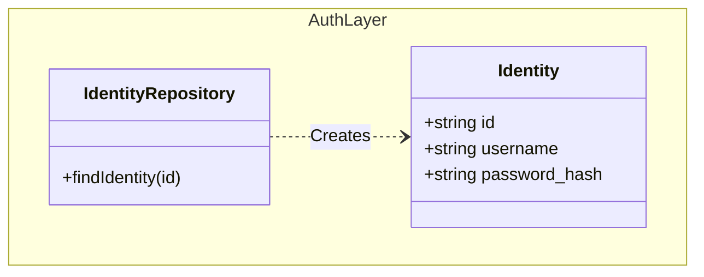

# 🧩 Key Components

This document details the key components and architectural patterns used in the application, specifically focusing on areas that might be confusing or require specific context.

## 👥 User Identity

The codebase currently uses a single User model for both authentication and identity.

### 1. Authentication Identity (`src/User/`)

*   **Location:** `src/User/Identity.php`, `src/User/IdentityRepository.php`
*   **Purpose:** Strictly for **Authentication** and **Session Management**.
*   **Interfaces:** Implements `Yiisoft\Auth\IdentityInterface`.
*   **Characteristics:**
    *   Lightweight (only contains fields needed for auth: ID, username, password hash).
    *   Used by the `CurrentUser` service to maintain login state.
    *   `IdentityRepository` implements `IdentityRepositoryInterface` to fetch identities for the auth subsystem.

**When to use:**
*   When checking if a user is logged in (`$currentUser->isGuest()`).
*   When getting the current user's ID (`$currentUser->getId()`).
*   In Login/Logout actions.

### Class Diagram

```mermaid
classDiagram
    direction TB
    namespace AuthLayer {
        class Identity {
            +string id
            +string username
            +string password_hash
        }
        class IdentityRepository {
            +findIdentity(id)
        }
    }

    IdentityRepository ..> Identity : Creates
```

---

## 🌐 Web Actions (`src/Web/`)

The Web layer is organized by **Feature**, not by technical layer (no global `controllers/` folder).

### Action Classes
Each HTTP endpoint maps to a single **Action class** (e.g., `App\Web\Auth\LoginAction`).
*   **Responsibility:** Handle the HTTP request, interact with the domain layer, and return a response.
*   **Dependency Injection:** Dependencies (like repositories) are injected into the constructor.
*   **Invokable:** They often implement `__invoke(ServerRequestInterface $request)`.

### Templates
Views are often located near their Actions or in a `views` subdirectory within the feature folder, though Yii3 allows flexibility here.

---

## ⚙️ Configuration Plugins

The application uses `yiisoft/config` to assemble configuration.

*   **Merge Plan:** `config/configuration.php` defines the order and source of config files.
*   **Params:** `config/common/params.php` is the place for simple key-value settings.
*   **Routes:** `config/common/routes.php` defines the URL mapping.

**Note:** Do not look for a single `web.php` or `main.php` like in Yii2. The config is an aggregate of many files.
