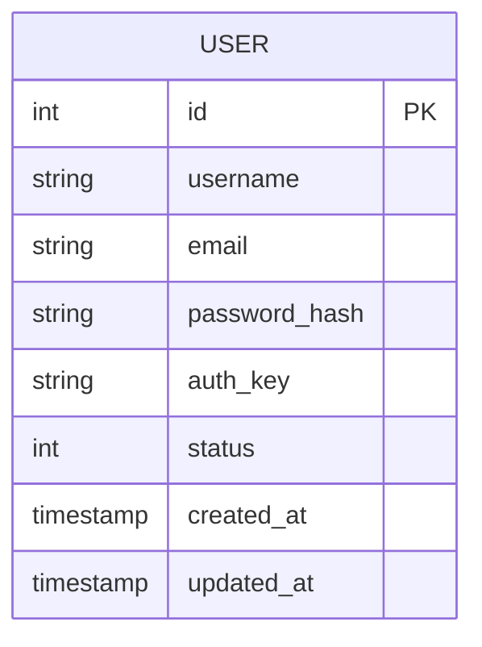

# 🗄️ Database Schema

This document outlines the database schema and its mapping to domain entities.

## 📋 Overview

The application uses **MySQL** (via `yiisoft/db`) as the primary data store.
Migrations are managed in the `migrations/` directory using `yiisoft/db-migration`.

## 📦 Tables

### `user`

Stores user account information.

**Migration:** `M20260115_CreateUserTable.php`

| Column | Type | Attributes | Description |
|--------|------|------------|-------------|
| `id` | `INT` | `PK`, `AI` | Primary Key |
| `username` | `VARCHAR(255)` | `NOT NULL`, `UNIQUE` | Unique username |
| `email` | `VARCHAR(255)` | `NOT NULL`, `UNIQUE` | Unique email address |
| `password_hash` | `VARCHAR(255)` | `NOT NULL` | Hashed password |
| `auth_key` | `VARCHAR(32)` | `NOT NULL` | "Remember Me" auth key |
| `status` | `SMALLINT` | `NOT NULL`, `DEFAULT 10` | Account status (0=Deleted, 9=Inactive, 10=Active) |
| `created_at` | `TIMESTAMP` | `NOT NULL`, `DEFAULT CURRENT_TIMESTAMP` | Creation timestamp |
| `updated_at` | `TIMESTAMP` | `NOT NULL`, `DEFAULT CURRENT_TIMESTAMP ON UPDATE...` | Last update timestamp |

**Indexes:**
- `idx-user-email` on `email`
- `idx-user-status` on `status`

## 🔄 Entity Mapping

The database table maps to the **Immutable User Entity** located at `src/Entity/User.php`.

> **Note:** Unlike Yii2's ActiveRecord, the Entity class is decoupled from the database. It does not contain `save()`, `update()`, or query methods. Data persistence is handled by the **Repository** pattern.

| DB Column | Entity Property | Type |
|-----------|-----------------|------|
| `id` | `$id` | `?int` |
| `username` | `$username` | `string` |
| `email` | `$email` | `string` |
| `password_hash` | `$passwordHash` | `string` |
| `auth_key` | `$authKey` | `string` |
| `status` | `$status` | `int` |
| `created_at` | `$createdAt` | `?DateTimeImmutable` |
| `updated_at` | `$updatedAt` | `?DateTimeImmutable` |

### Relationships

*Currently, the user table is standalone.*

## 📐 ER Diagram

