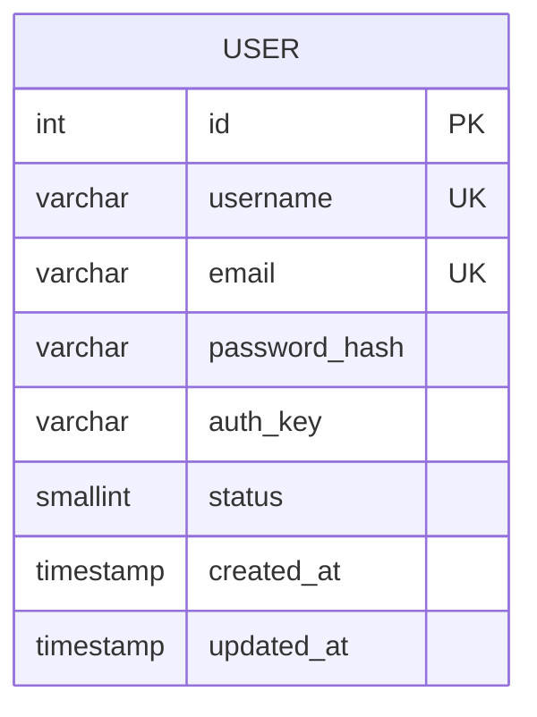

# 🗄️ Database Schema

This document outlines the database schema and its relationship to the Domain Entities.

## 📊 Overview

The application uses a relational database (MySQL/MariaDB by default). The schema is managed via **Yii3 Migrations** located in the `migrations/` directory.

### Entity Relationship Diagram (ERD)

## 📝 Tables

### `user`

Stores user account information. This table backs the `App\Entity\User` domain entity.

| Column | Type | Constraints | Description |
| :--- | :--- | :--- | :--- |
| `id` | `INT` | `PK`, `AUTO_INCREMENT` | Unique identifier. |
| `username` | `VARCHAR(255)` | `NOT NULL`, `UNIQUE` | User's display name. |
| `email` | `VARCHAR(255)` | `NOT NULL`, `UNIQUE` | User's email address. |
| `password_hash` | `VARCHAR(255)` | `NOT NULL` | Bcrypt/Argon2 password hash. |
| `auth_key` | `VARCHAR(32)` | `NOT NULL` | "Remember Me" authentication key. |
| `status` | `SMALLINT` | `NOT NULL`, `DEFAULT 10` | Account status (see below). |
| `created_at` | `TIMESTAMP` | `NOT NULL`, `DEFAULT NOW()` | Record creation time. |
| `updated_at` | `TIMESTAMP` | `NOT NULL`, `DEFAULT NOW()` | Last update time (auto-updates). |

#### Indexes
- `idx-user-email` on `email`
- `idx-user-status` on `status`

#### Domain Constants (`App\Entity\User`)
The `status` column maps to the following constants in the User Entity:
- `0`: `STATUS_DELETED`
- `9`: `STATUS_INACTIVE`
- `10`: `STATUS_ACTIVE`

## 🔗 Entity Mapping

The application follows a **Data Mapper** pattern (via Repositories) rather than ActiveRecord.

- **Table:** `user`
- **Entity:** `App\Entity\User`
- **Repository:** `App\Repository\UserRepository`

The `User` entity is **immutable**. Changes to the entity do not automatically persist to the database; you must save the entity via the `UserRepository`.
