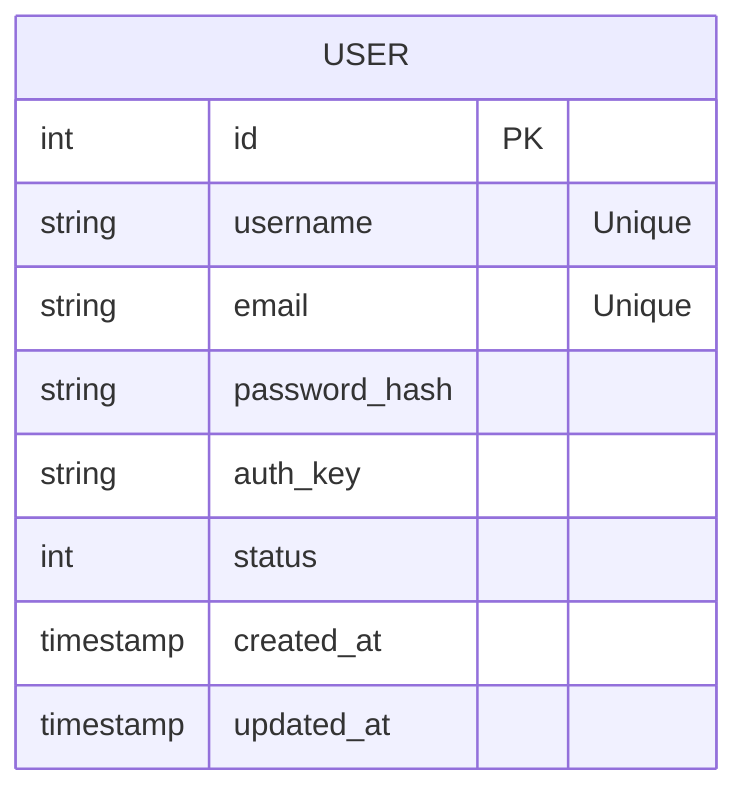

# 🗄️ Database Schema

The application uses a relational database (MySQL by default) with schema management via `yiisoft/db-migration`.

## Tables

### `user`

Stores user account information.

| Column | Type | Nullable | Default | Description |
|--------|------|----------|---------|-------------|
| `id` | `PK` | No | Auto-Inc | Unique user identifier |
| `username` | `VARCHAR(255)` | No | - | Unique username |
| `email` | `VARCHAR(255)` | No | - | Unique email address |
| `password_hash` | `VARCHAR(255)` | No | - | BCrypt/Argon2 password hash |
| `auth_key` | `VARCHAR(32)` | No | - | "Remember Me" / API authentication token |
| `status` | `SMALLINT` | No | `10` | Account status (10 = Active) |
| `created_at` | `TIMESTAMP` | No | `NOW()` | Account creation timestamp |
| `updated_at` | `TIMESTAMP` | No | `NOW()` | Last update timestamp |

**Indexes:**
- `idx-user-email` on `email`
- `idx-user-status` on `status`

## Entity Mapping

The `user` table maps to two distinct classes in the codebase, following the Separation of Concerns principle:

1.  **Domain Entity (`App\Entity\User`):**
    -   Represents the user in business logic.
    -   Immutable object.
    -   Located in `src/Entity/User.php`.

2.  **Auth Identity (`App\User\Identity`):**
    -   Represents the currently authenticated user.
    -   Implements `Yiisoft\Auth\IdentityInterface`.
    -   Located in `src/User/Identity.php`.

## 🖼️ ER Diagram

