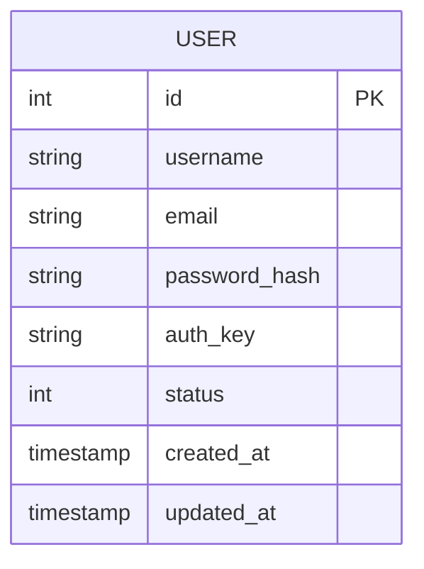

# 🗄️ Database Schema

This document details the database schema and entity relationships for the application.

## 📋 Overview

The application uses a relational database (MySQL by default). The schema is managed via migrations located in `migrations/`.

## 📦 Tables

### `user`

The `user` table stores authentication identity and profile information.

| Column | Type | Nullable | Default | Description |
| :--- | :--- | :--- | :--- | :--- |
| `id` | `INT` (PK) | No | Auto Inc | Unique identifier |
| `username` | `VARCHAR(255)` | No | - | Unique username |
| `email` | `VARCHAR(255)` | No | - | Unique email address |
| `password_hash` | `VARCHAR(255)` | No | - | Hashed password (Argon2id/Bcrypt) |
| `auth_key` | `VARCHAR(32)` | No | - | "Remember Me" authentication key |
| `status` | `SMALLINT` | No | `10` | User status (10=Active, 9=Inactive, 0=Deleted) |
| `created_at` | `TIMESTAMP` | No | `CURRENT_TIMESTAMP` | Record creation time |
| `updated_at` | `TIMESTAMP` | No | `CURRENT_TIMESTAMP` | Record update time |

**Indexes:**
*   `idx-user-email` (on `email`)
*   `idx-user-status` (on `status`)

## 📐 Entity Relationship Diagram (ERD)

## 📝 Notes

*   **Status Codes:** The `status` column maps to constants in `App\Entity\User`:
    *   `10`: Active (`STATUS_ACTIVE`)
    *   `9`: Inactive (`STATUS_INACTIVE`)
    *   `0`: Deleted (`STATUS_DELETED`)
*   **Immutability:** The `App\Entity\User` class maps to this table but is immutable. Updates require creating a new instance or using the repository to persist changes.
