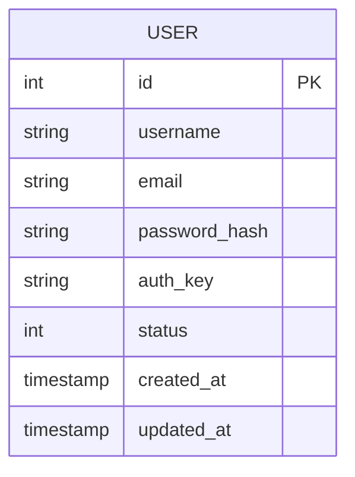

# 🗄️ Database Schema

This document outlines the database schema for the application.

## 📊 ER Diagram



## 📋 Tables

### `user`
Stores user account information for both authentication and profile management.

| Column | Type | Nullable | Default | Description |
| :--- | :--- | :--- | :--- | :--- |
| `id` | `INT` | NO | Auto-Increment | Primary Key |
| `username` | `VARCHAR(255)` | NO | - | Unique username |
| `email` | `VARCHAR(255)` | NO | - | Unique email address |
| `password_hash` | `VARCHAR(255)` | NO | - | Bcrypt password hash |
| `auth_key` | `VARCHAR(32)` | NO | - | Cookie auth key ("remember me") |
| `status` | `SMALLINT` | NO | `10` | User status (10=Active, 9=Inactive, 0=Deleted) |
| `created_at` | `TIMESTAMP` | NO | `CURRENT_TIMESTAMP` | Creation timestamp |
| `updated_at` | `TIMESTAMP` | NO | `CURRENT_TIMESTAMP` | Last update timestamp |

**Indexes:**
- `idx-user-email` on `email`
- `idx-user-status` on `status`

## 🔗 Relationships

*Currently, the application is single-entity focused around the User. No foreign key relationships exist yet.*

## 🛠️ Access Patterns

The database is accessed via the **Repository Pattern**.
- **No ActiveRecord:** The application uses `yiisoft/db` Query Builder directly.
- **Repositories:** `App\Repository\UserRepository` contains all SQL/Query logic.
- **Hydration:** Repositories manually map database rows (arrays) to immutable Domain Entities (e.g., `App\Entity\User`).

**Example Query (in Repository):**
```php
$row = (new Query($this->db))
    ->from('{{%user}}')
    ->where(['id' => $id])
    ->one();
```
