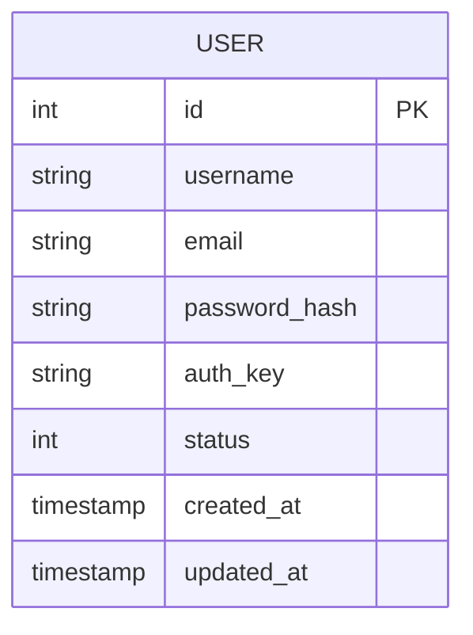

# 🗄️ Database Schema

This document details the database schema and entity relationships.

## 📊 Overview

The application uses a relational database (MySQL/MariaDB) accessed via `yiisoft/db`.
Schema changes are managed via Migrations in `migrations/`.

## 📐 ER Diagram

## 📝 Tables

### `user`

Stores user accounts and authentication data.

**Source Migration:** `migrations/M20260115_CreateUserTable.php`

| Column | Type | Constraints | Description |
| :--- | :--- | :--- | :--- |
| `id` | `INT` | `PK`, `AUTO_INCREMENT` | Unique identifier for the user. |
| `username` | `VARCHAR(255)` | `NOT NULL`, `UNIQUE` | Unique username. |
| `email` | `VARCHAR(255)` | `NOT NULL`, `UNIQUE` | Unique email address. |
| `password_hash` | `VARCHAR(255)` | `NOT NULL` | Hashed password. |
| `auth_key` | `VARCHAR(32)` | `NOT NULL` | "Remember me" authentication key. |
| `status` | `SMALLINT` | `NOT NULL`, `DEFAULT 10` | Account status (e.g., 10 = Active). |
| `created_at` | `TIMESTAMP` | `NOT NULL`, `DEFAULT CURRENT_TIMESTAMP` | Record creation time. |
| `updated_at` | `TIMESTAMP` | `NOT NULL`, `DEFAULT CURRENT_TIMESTAMP` | Last update time (auto-updates). |

**Indexes:**
*   `idx-user-email` on `email`
*   `idx-user-status` on `status`
